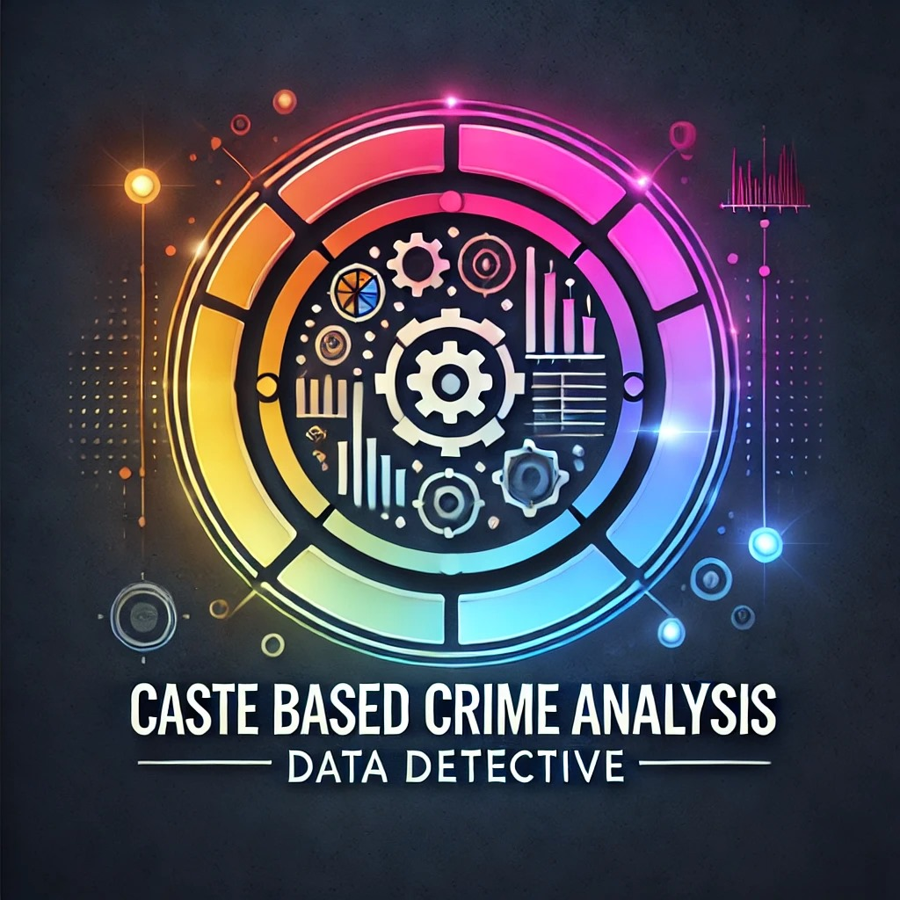

---

# Caste Based Hate Crime Analysis Dashboard

## Introduction
This project is a **Streamlit-based interactive dashboard** designed to visualize and analyze caste-based hate crime data across various states and districts. It helps users gain insights into crime trends by filtering data based on years and locations. The dashboard displays key indicators such as the total number of crimes, murders, assaults, kidnappings, and other crime statistics in a visually appealing and interactive manner.

## Project Type
**Frontend**

This project uses Streamlit to create an engaging user interface, allowing users to filter data, visualize trends, and explore crime data interactively.

## Deployed App
You can access the deployed application here:
- **🚔Crime Dashboard:** [Link to deployed Streamlit app](https://data-detectives.streamlit.app/)

## Directory Structure
```
Caste_based_hate_crime_Analysis/
├─ pages/
│  ├─ 2_🚓Crime_Dashboard.py
│  ├─ 3_📈Trends_Dashoard.py
├─ Menu.py
├─ Preprocessor.py
├─ README.md
├─ crime_by_district_rt_1.csv
├─ group_logo.jpg
├─ requirements.txt
```

## Video Walkthrough of the Project
Watch a short video walkthrough of the app's features and functionality:
[Link to video](https://youtu.be/9cKo2UWNtyg)

## Features
This dashboard offers the following features:
- **Year and State Filtering:** Allows users to filter crime data by year and state.
- **Crime Metrics:** Displays key crime indicators such as total crimes, murders, assaults, and kidnappings.
- **Visualization:** Interactive charts and graphs for better data interpretation.
- **Multi-column Layout:** Organized display of crime metrics across multiple columns for easy comparison.
  
## Design Decisions and Assumptions
- **Streamlit** was chosen for its simplicity in building dashboards with minimal setup.
- **Data Preprocessing** is handled using a custom preprocessor to clean and standardize the dataset.
- **Seaborn, Matplotlib, and Plotly** are used for plotting data, giving the dashboard interactive and static visual capabilities.

## Installation & Getting Started
To set up the project on your local machine, follow these steps:

1. Clone the repository
    ```bash
    git clone https://github.com/agarwalmohit26/Caste_based_hate_crime_Analysis.git
    ```
2. Navigate to the project directory
    ```bash
    cd Caste_based_hate_crime_Analysis
    ```
3. Install the required dependencies
    ```bash
    pip install -r requirements.txt
    ```
4. Run the Streamlit app
    ```bash
    streamlit run Caste_based_hate_crime_Analysis/Menu.py
    ```

## Usage
Once the app is running, select the desired **Year** and **State** from the sidebar filters to explore the crime statistics. Key crime metrics will be updated dynamically based on the selected filters. 

Example usage:
```bash
# Filter data by year 2015 and state Maharashtra
```

## APIs Used
No external APIs are used in this project. All data is sourced from a local CSV file (`crime_by_district_rt.csv`).

## Technology Stack
- **Streamlit** - for building the dashboard.
- **Pandas** - for data manipulation and cleaning.
- **Seaborn, Matplotlib, Plotly** - for data visualization.
- **Python** - backend logic for processing and filtering the dataset.

# Key Dates and Activities

## 1st October 2024:
- **Logo Creation**: Designed the project logo.
### Project Logo


- **GitHub Repository Setup**: Created the repository to document and share the project.

## 2nd October 2024:
- **Reading Datasets**: Imported relevant datasets into the project.
- **Data Merging**: Combined datasets as per project requirements.
- **Data Insights**: Extracted specific insights from different columns required for analysis.
- **Correlation Analysis**: Identified correlations between different columns to assess attribute dependencies.
- **Data Visualization**: Visualized key attributes to facilitate data-driven decisions.

## 3rd October 2024:
- **Extracting Insights**: Gaining valuable insights from merged datasets.
- **Data Visualization**: Employing appropriate visualization methods to present the data effectively.
- **Error Rectification**: Fixing errors related to datetime formats.
- **Streamlit Application**: Initiating the development of an interactive Streamlit app.

## 4th October 2024:
- **Key Insights Choosing**: Extracting key insights for dashboard building.
- **Streamlit Application**: Building all dashboard features and making it interactive.
- **Discussing Main Points**: Discussing main key points
  
---
